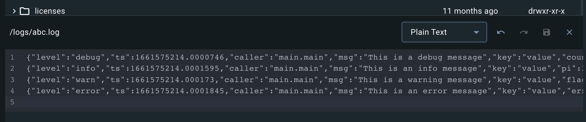
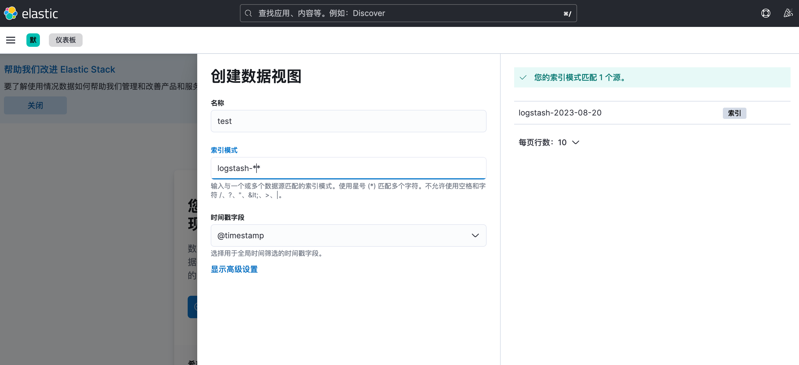
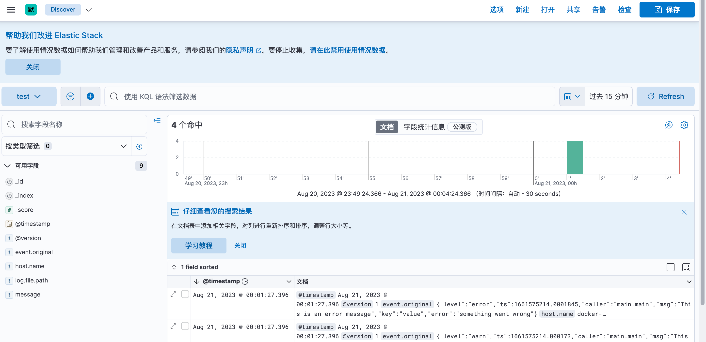

### 项目启动
logstash 处理容器中的 logs 目录「项目的 data/logs/*.log」 下的数据，存储到 data/elasticsearch 下
```
docker-compose up -d
```

### 登录 es
```
http://localhost:9200/
name: elastic
pwd: elastic
```

### 访问 kibana
```
http://localhost:5601/
```

### 更新 logstash 容器中的文件数据


### kibana 查询


